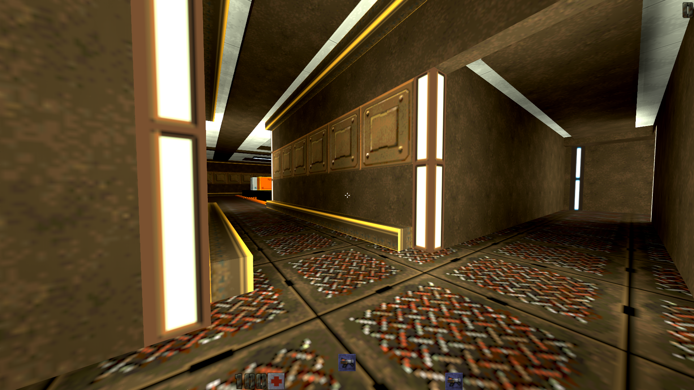

# Quake II RTX Mapping
Maps made excursively for Quake II with RTX

- q2vkpt + Quake II from GOG.com
- TrenchBroom (mapping)
- q2tools 220 (compiling)
- Wally (textures)

## Mansion (beta)

## Hardware

- Intel i3-7100 (4) @ 3.900GHz 
- nVidia GeForce 2060 RTX
- 2x4GB RAM
- M.2 NVME SSD + 2x 2TB HDD
- 40" NEC Professional-Grade LSD (Large-Screen Display)